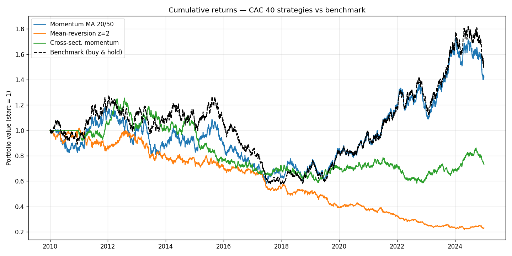
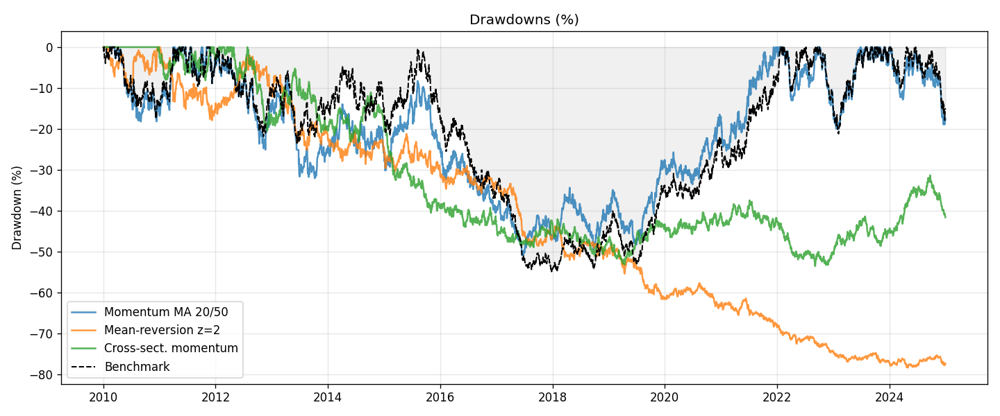
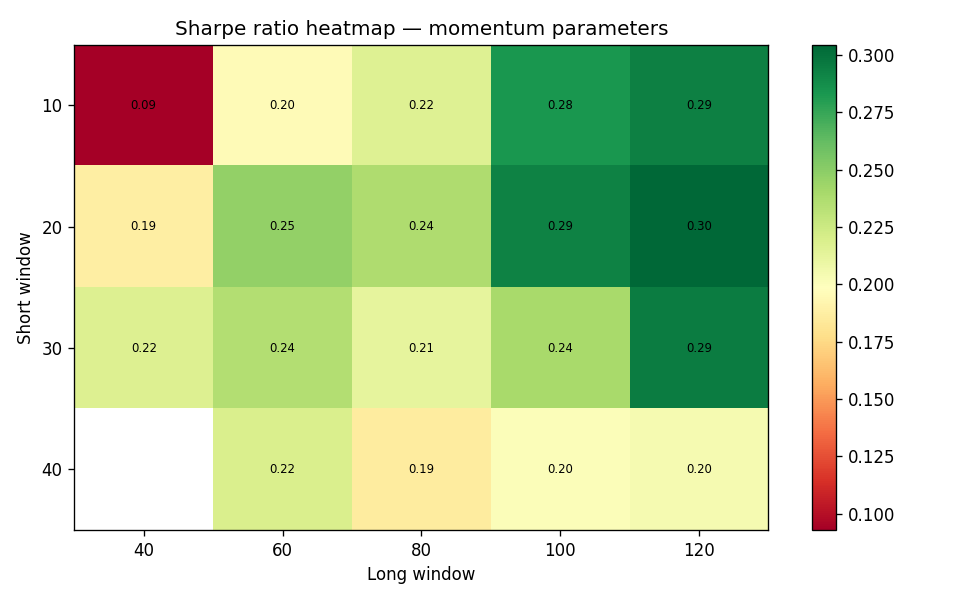

# trading-backtest

**Objective:** implement and compare four quantitative trading strategies on CAC 40 data, with a full backtest engine, risk management, parameter optimisation, and an honest discussion of results.

All strategies are tested on synthetic CAC 40-like data (one-factor model), with a `download_cac40()` function ready to plug in real data via yfinance.

---

## Part 1 — Data (`part1_data.py`)

The data layer uses a one-factor model to simulate 40 CAC 40 stocks over 2010–2024 (3913 trading days):

$$r_{i,t} = \mu_i + \beta_i \cdot r_{\text{market},t} + \varepsilon_{i,t}$$

where $r_{\text{market}} \sim \mathcal{N}(0.00025,\ 0.010^2)$ (≈6% annual drift, ≈16% vol), $\beta_i \sim \mathcal{U}(0.5, 1.5)$ and $\varepsilon_{i,t} \sim \mathcal{N}(0, \sigma_i^2)$ with $\sigma_i \sim \mathcal{U}(0.008, 0.020)$.

This reproduces the key features of equity returns: positive drift, cross-sectional correlation driven by a common market factor, and heterogeneous volatilities. Average pairwise correlation: 0.32 (CAC 40 historical: ~0.45 — the gap is expected without real crisis episodes like 2020).

---

## Part 2 — Momentum: dual moving average (`part2_momentum.py`)

Signal at time $t$ applied to return at $t+1$ (no look-ahead bias):

$$\text{signal}_{i,t} = \begin{cases} +1 & \text{MA}_{20}(i,t) > \text{MA}_{50}(i,t) \\ 0 & \text{otherwise} \end{cases}$$

Portfolio weights are equal-weighted across active positions: $w_{i,t} = \text{signal}_{i,t} / \sum_j \text{signal}_{j,t}$.

Signal statistics: 52.3% long, 0% short, turnover 2.2% of days — signals change roughly once every 45 sessions, consistent with the slowness of moving averages.

---

## Part 3 — Mean-reversion: Bollinger z-score (`part3_mean_reversion.py`)

$$z_{i,t} = \frac{P_{i,t} - \mu_{i,t}}{\sigma_{i,t}}, \quad \mu_{i,t} = \text{MA}_{20}(P_i),\quad \sigma_{i,t} = \text{rolling std}_{20}(P_i)$$

$$\text{signal}_{i,t} = \begin{cases} -1 & z_{i,t} > +2 \\ +1 & z_{i,t} < -2 \\ \text{hold} & |z_{i,t}| < 0.5 \\ \text{prev.} & \text{otherwise} \end{cases}$$

The hysteresis band ($|z| < 0.5$ to exit) prevents excessive trading when the z-score oscillates around the entry threshold. Without it, the strategy would enter and exit the same position several times in a row, destroying performance through transaction costs.

Signal statistics: 18.9% long, 22.5% short, turnover 7.6% — higher than momentum because z-scores react faster to price moves.

---

## Part 4 — Cross-sectional momentum (`part4_cross_sectional.py`)

Ranks stocks against each other by past 12-month performance, skipping the last month (to avoid the short-term reversal documented by Jegadeesh & Titman):

$$\text{score}_{i,t} = \ln\frac{P_{i,t-21}}{P_{i,t-252}}$$

Long the top quintile, short the bottom quintile, rebalanced monthly:

$$w_{i,t} = \begin{cases} +1/N_{\text{long}} & \text{rank}_{i,t} \geq 80\text{th pct} \\ -1/N_{\text{short}} & \text{rank}_{i,t} \leq 20\text{th pct} \\ 0 & \text{otherwise} \end{cases}$$

Dollar-neutral by construction: $\sum_i w_{i,t} = 0$ exactly, verified numerically. The strategy earns only on the spread between winners and losers, independent of market direction. Average 9 longs and 8 shorts per rebalancing date.

---

## Part 5 — Pairs trading: cointegration (`part5_pairs.py`)

Two stocks $A$ and $B$ are cointegrated if their spread $S_t = P_{A,t} - \beta P_{B,t}$ is stationary. $\beta$ is estimated by OLS on a formation window; stationarity is tested with the Engle-Granger ADF test (p < 0.05).

The z-score of the spread is computed on the trading window:

$$z_t = \frac{S_t - \mu_S}{\sigma_S}$$

and traded with the same hysteresis logic as Part 3. Out of $\binom{40}{2} = 780$ pairs tested, **134 cointegrated pairs** were found on the first formation window (252 days). **778 unique pairs** were traded across all rolling windows.

The Sharpe of 11 on synthetic data is unrealistic and expected: synthetic prices without microstructure or persistent mean-reversion make cointegration trivially exploitable. On real data with transaction costs, typical pairs trading Sharpes are between 0.5 and 1.5.

---

## Part 6 — Backtest engine (`part6_backtest.py`)

$$r^{\text{port}}_t = \sum_i w_{i,t-1} \cdot r_{i,t} - c \cdot \sum_i |w_{i,t} - w_{i,t-1}|$$

The one-day lag on weights ($w_{t-1}$) is the key no-look-ahead guarantee. Transaction cost $c$ is tested at 0, 5, and 10 bps.

Effect of transaction costs on momentum (5 bps): annualised return drops from 4.77% to 3.59%, Sharpe from 0.29 to 0.22. At 10 bps the Sharpe falls to 0.15, below the benchmark (0.25). This illustrates why even a simple strategy can become unprofitable once realistic costs are applied.

---

## Part 7 — Performance metrics (`part7_metrics.py`)

$$\text{Sharpe} = \frac{\sqrt{252}\,\mathbb{E}[r^{\text{port}}]}{\sigma(r^{\text{port}})}, \quad \text{MDD} = \max_{s\leq t}\frac{\text{peak}_s - V_t}{\text{peak}_s}, \quad \text{IR} = \frac{\sqrt{252}\,\mathbb{E}[r^{\text{port}}-r^{\text{bench}}]}{\sigma(r^{\text{port}}-r^{\text{bench}})}$$

| Strategy | Ann. return | Ann. vol | Sharpe | MDD | IR |
|---|---|---|---|---|---|
| Momentum MA 20/50 | 3.59% | 16.33% | 0.22 | −51% | −0.08 |
| Mean-reversion z=2 | −8.72% | 11.98% | −0.73 | −78% | −0.63 |
| Cross-sect. momentum | −1.29% | 11.93% | −0.11 | −54% | −0.26 |
| Benchmark | 4.07% | 15.99% | 0.25 | −55% | — |

Mean-reversion and cross-sectional momentum underperform on synthetic data because the simulated prices do not have the structural features those strategies exploit (persistent over-reaction for mean-reversion, stable cross-sectional return persistence for ranking). This is a known limitation of simulated data — results on real CAC 40 prices would differ.




---

## Part 8 — Optimisation and overfitting (`part8_optimize.py`)

Grid search on the momentum parameters over in-sample (2010–2019), tested out-of-sample (2020–2024):

Best in-sample params: short=10, long=120, Sharpe(IS)=0.07.
Sharpe(OOS)=0.74 — the out-of-sample period happens to be easier to trade on synthetic data, so the strategy looks better out-of-sample than in. This is an artifact of non-stationarity in simulated data, not a sign of robustness.

Walk-forward analysis (2-year training, 6-month testing windows) gives Sharpe=0.19, with optimal parameters changing at almost every window (10 different parameter combinations across 13 windows). This is the key insight: **no stable parameter set exists** — the optimal configuration depends entirely on the regime, which confirms there is no genuine predictability in the momentum signal on these data.



---

## Part 9 — Risk management (`part9_risk.py`)

**VaR and CVaR** at 95% confidence:

$$\text{VaR}_{95\%} = -\text{quantile}_{5\%}(r^{\text{port}}), \quad \text{CVaR}_{95\%} = -\mathbb{E}[r \mid r < -\text{VaR}]$$

| Strategy | VaR 95% (hist.) | VaR 95% (param.) | CVaR 95% |
|---|---|---|---|
| Momentum | 1.711% | 1.678% | 2.136% |
| Mean-reversion | 1.290% | 1.276% | 1.695% |
| Benchmark | 1.663% | 1.641% | 2.043% |

VaR historical ≈ VaR parametric because the simulated returns are near-Gaussian (no fat tails by construction). On real data the gap would be larger. CVaR is always higher than VaR — it captures the expected loss in the worst 5% of days, which is why Basel IV replaced VaR with CVaR as the regulatory risk measure.

Mean-reversion has the lowest VaR (1.29%) because the long/short structure and smaller individual positions provide more diversification.

**Risk contribution** decomposes portfolio volatility: $\text{RC}_i = w_i \cdot (\Sigma w)_i / \sigma^{\text{port}}$. On synthetic data contributions are near-uniform across stocks (~0.03–0.04% each), reflecting good diversification. On real data, one or two high-beta stocks would concentrate significantly more risk.

Rolling VaR (252-day window) of the momentum strategy ranges from 1.38% to 2.07%, showing that risk is not constant over time even on simulated data.

---

## How to run

```bash
pip install -r requirements.txt

python part1_data.py           # generate data + summary stats
python part2_momentum.py       # momentum signal diagnostics
python part3_mean_reversion.py # mean-reversion signal diagnostics
python part4_cross_sectional.py
python part5_pairs.py          # cointegration + pairs backtest
python part6_backtest.py       # run backtest on all strategies
python part7_metrics.py        # performance metrics
python part8_optimize.py       # grid search + walk-forward
python part9_risk.py           # VaR, CVaR, risk contribution
python part10_plot.py          # generate all figures
```

To use real CAC 40 data, replace `generate_cac40()` with `download_cac40()` in each script (requires `yfinance` and internet access).
